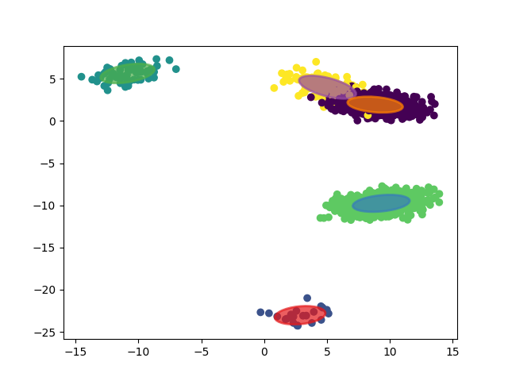

# Multivariate Gaussian Mixture Model using PyTorch + geotorch

Этот пакет позволяет:
- создавать смеси многомерных нормальных распределений;
- сэмлировать случайные данные;
- оценивать параметры, оптимизируя правдоподобие с помощью метода градиентного спуска;
- визуализировать смеси;

# Параметризация
Так как смесь гауссовских распределений налагает ограничения на матрицу ковариаций(положительная полуопределенность) и на вероятность принадлежности к классу (`p1 + ... + pk = 1`), простой градиентный шаг не применим из-за того, параметры могут перестать удовлетворять условиям. Параметризация позволяет решить эту проблему, отображая параметры в пространство, в котором все элементы после отображения будут удовлетворять ограничениям. Самый яркий пример такой параметризации - это всем известный `Softmax`, который отображает произвольный вектор в вероятности. Для сохранения положительной полуопределенности матрицы ковариаций (а точнее ее обратной) использована библиотека `geotorch`.